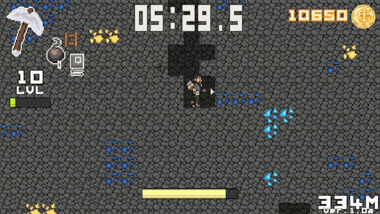
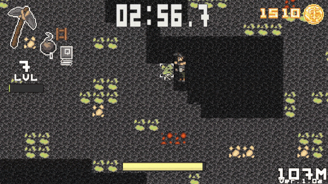
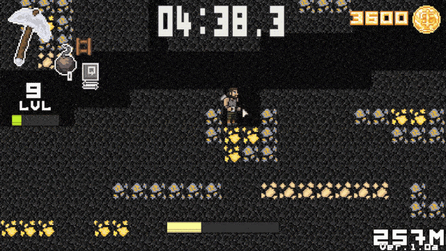

# Kopalniarze

## Introduction

Kopalniarze is a pixel-art styled 2D game about mining where your main goal is
to reach the deepest level under the surface as fast as possible.

## Features

### Upgrade your gear

### Level up your skills

### Use accessories for faster progress

### Other

* Game Loop
* Procedural world generation
* OpenGL rendering
* 2D Physics
* Animations

### Art

* 3D handmade game assets
* Music and sound effects

## Technologies

* [OpenTK](https://opentk.net/)
* [irrKlang](https://www.ambiera.com/irrklang/)

## Requirements

* [.NET Core 3.x](https://dotnet.microsoft.com/en-us/download/dotnet/3.1)
